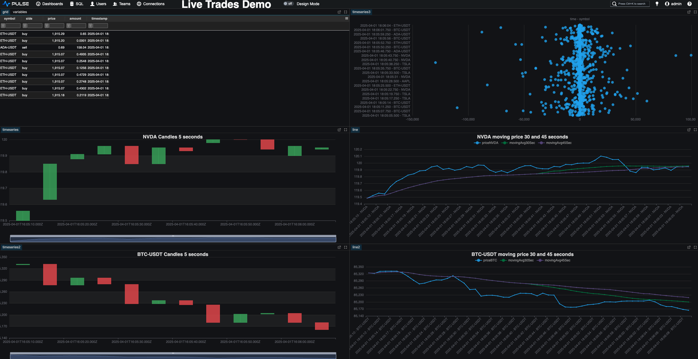

# questdb-trading-data-demo

This repository can be used as a quickstart to ingest and explore financial data with QuestDB. The project
uses Jupyter Notebook to get data from external sources and store into QuestDB, and it also uses either Grafana or
Pulse to display near real-time dashboards.

The repository includes example scripts to ingest data from two data sources:

    * US Equities Data (streamed from a historical file, simulating real-time trading)
    * Digital assets trading data from OKX (the same data source powering the public demo at https://demo.questdb.io)


To make installation of dependencies as simple as possible, this repository includes a `docker-compose.yml` file that
starts everything in one go.


## Pre-requisites

If you need more context about why QuestDB is the best choice for storing Tick data, please refer
to [the QuestDB For Tick Data](/docs/QuestDB-For-Tick-Data.md) page.

A working installation of Docker and docker-compose.


## Starting up via Docker-compose


From the root directory of this repository, execute:

`docker-compose up`

This might take a few moments the first time, as it needs to download several docker images and initialize them. For
reference, a cold start on an M1 laptop over a wired connection it takes between 30 seconds and 1 minute. Subsequent
starts should be way faster. The downloaded images will use about 1Gb on your disk.

If you notice any permissions error on the logs (typically Grafana complaining a folder is not writable), this is
probably due to your system running docker as root. You can fix this by setting the following env variable:

```
export DOCKER_COMPOSE_USER_ID=$(id -u)
```

or like this
```
sudo DOCKER_COMPOSE_USER_ID=$(id -u) docker-compose up
```


After a few moments, you should see the logs stabilize and stop scrolling fast. There will always be some log activity,
 but those appear only every few seconds.


If you want to stop the components at any point, you can just `ctrl+c` and you can restart later running
`docker-compose up`. For more permanent removal, please do check the
[Stopping all the components](#stopping-all-the-components) section.


## End-to-end ingestion and visualization

### Ingesting the trading real-time data

Once the infrastructure is up and running, you can navigate to `http://localhost:8888/`. You  will see two available
scripts/notebooks you can run directly from your browser:

* http://localhost:8888/notebooks/00-Ingest-real-time-data-from-a-file.ipynb
* http://localhost:8888/notebooks/01-Capture-digital-assets-live-data.ipynb


The two scripts read data from different sources, but the data will be stored in a single table named `trades`,
independently where the data is coming from.  The schema of the table is shown below. If the table does not exist, it
will be automatically created on the first write.

```sql
CREATE TABLE 'trades' (
	symbol SYMBOL CAPACITY 256 CACHE,
	side SYMBOL CAPACITY 256 CACHE,
	price DOUBLE,
	amount DOUBLE,
	timestamp TIMESTAMP
) timestamp(timestamp) PARTITION BY DAY WAL;
```

### Querying data

While any of the notebooks is executing, to see the live data on your database, you can open a new tab on your browser
and navigate to `http://localhost:9000`. This will open the QuestDB web console. You can then execute a simple query
like `SELECT * FROM trades -10;` to see the latest 10 trades. Or you could execute a sligthly more sophisticated query
like `select timestamp, symbol, side, sum(price * amount) from trades sample by 1m; ` to get the totals for each
symbol at 1 minute intervals.

For some more realistic queries, please open in a new tab the
[Examples-of-market-data-queries notebook](http://localhost:8888/notebooks/Examples-of-market-data-queries.ipynb).

### Visualization using a third party dashboard

This demo includes two different real-time dashboards, one powered by Grafana, and another powered by Pulse.

If you want to see your live data on a Grafana dashboard, please navigate in a new tab to
[the demo Grafana dashboard](http://localhost:3000/d/live-trades-demo/live-trades-demo). The user is `admin` and password `quest`

If you want to see your live data on a Pulse dashboard, please navigate in a new tab to
[the demo Pulse dashboard](http://localhost:8080/dash/29/Live%20Trades%20Demo). More info at [Pulse](https://www.timestored.com/pulse/).



## Stopping all the components

You can stop all the components by running
`docker-compose down`

Alternatively you can also remove the associated docker volumes (the locally mounted directories will keep the data and
configurations)
`docker-compose down -v`

If you want to remove all the components and their associated docker images (they use about 1Gig on your disk), you can run
`docker-compose down -v --rmi all`

Please note this will still keep the data in the locally mounted directories, most notably in the QuestDB, and Grafana
folders. You can remove the local data like this
`rm -r questdb/questdb_root/* dashboard/grafana/home_dir/var_lib_grafana/alerting dashboard/grafana/home_dir/var_lib_grafana/grafana.db dashboard/grafana/home_dir/var_lib_grafana/csv`
