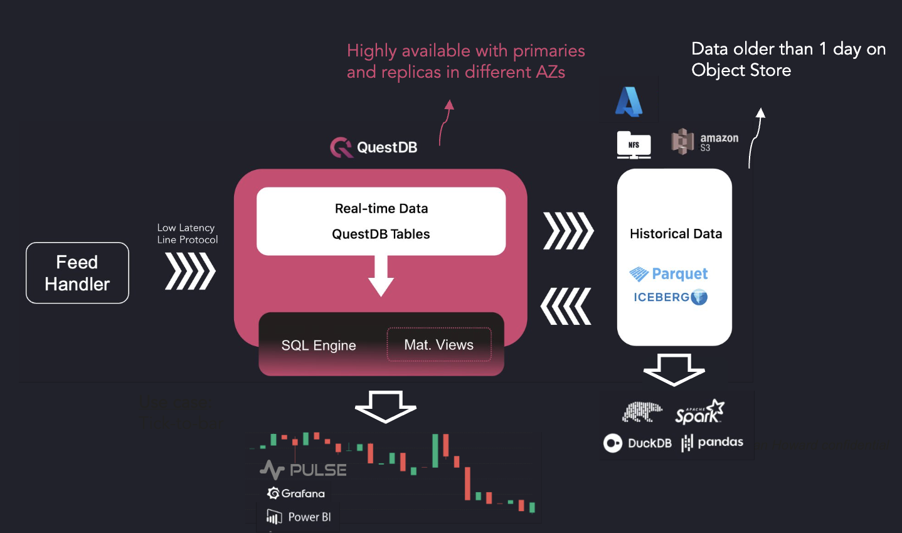
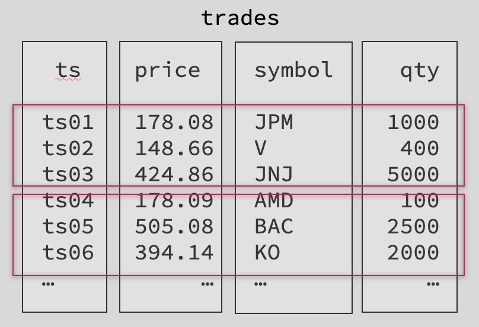
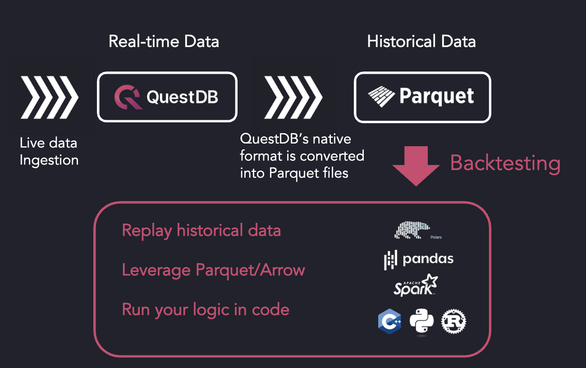
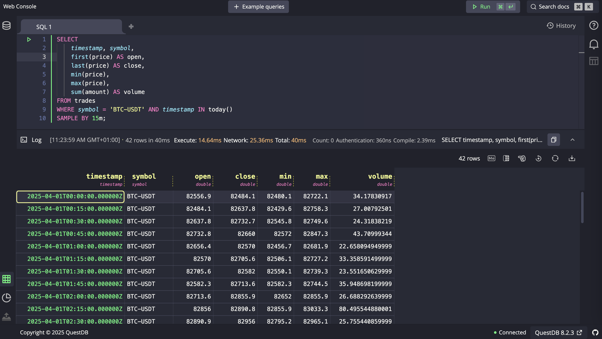

## About QuestDB

QuestDB is a high-performance database designed for tick data, providing fast ingestion and low-latency querying while
relying on open formats to prevent vendor lock-in. The query language is SQL, and QuestDB stores historical data as
Parquet, enabling native queries on Parquet files directly from object storage. These Parquet files can also be accessed
directly from ML/AI tools such as data frame libraries, facilitating direct access and bypassing the database for
workflows like backtesting.

QuestDB open source has gathered more than 15,000 GitHub stars and ranks as the fastest growing time-series database in
the world on [DB-Engines](https://db-engines.com/en/ranking/time+series+dbms).

Our production deployments include Tier 1 and Tier 2 investment banks, some of the largest hedge funds worldwide, leading
national exchanges, and the largest crypto firms and exchanges.

QuestDB's engineering team has decades of experience building low-latency trading software in capital markets at Tier 1
banks including BoA, UBS, HSBC.

---

## The Future of Tick Data Infrastructure

The future of tick data infrastructure is open. Open source tools and standards have emerged and now require
interoperability from time-series databases to work seamlessly together.

- **Apache Parquet** and **Apache Iceberg** are the new open standards for compressed historical data.

- **Apache Arrow** is an emerging leading format for in-memory computations.

QuestDB natively supports Apache Parquet and Iceberg and will soon support Apache Arrow (via ADBC). QuestDB is open
source and supports SQL. It can seamlessly connect to a wide ecosystem of tools via PGwire.

Consequently, QuestDB avoids vendor lock-in and makes it possible to leverage existing open source AI/ML tools.

---

## QuestDB Architecture

QuestDB ingests tick data into its own native format, which is heavily optimized for time-series data. QuestDB's design
guarantees low-latency SQL queries.

QuestDB avoids vendor lock-in by transforming its historical time partitions into Parquet files, which are automatically
moved to Object Stores. These Parquet files are then accessible by the firm's Python infrastructure, enabling the use of
AI/ML tools such as data frame libraries natively.

---

## QuestDB's Storage Engine

- **Ideal data layout** for fast time-based queries: columnar store, time-partitioned, and time sorted without indexes

- **Relational model**: Tables, ASOF JOINs, SQL with time-series extensions

- **Heavy parallelism**: SIMD instructions, SQL JIT Compiler & multi-thread/multi-processor execution

- **Array type support** (coming in QuestDB 8.2.4) to store and query order books efficiently

---

## QuestDB leveraging existing Python infrastructure: example with Backtesting

## SQL Queries

QuestDB's querying language is SQL, with additional native time-series extensions. It includes Window Functions and
Materialized Views.

---

## Use Cases

### Tick Data Storage

Ingest and store Level 1, 2, and 3 market data. Order books are represented as 2D arrays and processed via a
high-performance binary protocol.

### Dynamic Bar Charts

Generate real-time OHLC bars (e.g. 1-sec, 5-sec, 1-min) with cascading views for efficient multi-resolution analysis.

### Trade Troubleshooting

Correlate trades with order book snapshots using ASOF JOINs to identify execution context and price slippage.

### Top of Book Analysis

Evaluate best bid/ask levels at trade time to ensure executions align with optimal market conditions.

### Mid-Price Tracking

Monitor mid-price movement post-trade to assess market impact and slippage.

### Real-Time Dashboards

Power time-series dashboards (e.g. QStudio, Grafana) with low-latency data feeds for live monitoring of prices, volumes,
intraday PnL, and risk metrics.

### Backtesting

Run high-speed backtests on historical data stored in Parquet. Use Apache Arrow via ADBC for in-memory processing
in Python and other ecosystems.

### Intraday Algo Trading

Update indicators on every tick (e.g. fair value) to drive algo trade decisions and inventory management.

### Risk Monitoring

Track real-time risk ratios, margin exposure, and stress metrics throughout the trading day.

### Market Impact & Decay Analysis

Analyze how prices evolve after trades to quantify market impact, decay curves, and execution quality.

---

## Running QuestDB to Ingest Trading Data

QuestDB's license is permissive under Apache 2.0. QuestDB Enterprise offers security, scalability, and multi-tiered storage.

Installing QuestDB Open Source is straightforward: [Quick Start Guide](https://questdb.com/docs/quick-start/)

To quickly test QuestDB, we suggest two options:

1. **Running queries on our public demo instance**

Visit [demo.questdb.io](https://demo.questdb.io), which captures live trading data from a digital asset exchange.

2. **Starting QuestDB locally**

Ingest real-time market data, execute queries, and set up real-time dashboards.

We’ve prepared [a repository](https://github.com/questdb/questdb-trading-data-demo) that captures data from an exchange
feed and stores it in a local QuestDB instance.

If you prefer to test in an isolated environment, a script is also provided to simulate live data using a local
historical CSV file.

The repo includes demo queries and a real-time sample dashboards powered by Pulse and Grafana.

---

## How We Benchmark QuestDB

**[The Time Series Benchmark Suite](https://github.com/questdb/tsbs)** is an open-source benchmark for databases
designed specifically for time-series data.

- Focuses on streaming ingestion (vs batch)

- Allows cardinality configuration

- Features time-series queries (aggregations, time intervals)

---

## Engaging with QuestDB to Run a PoC

We work alongside companies to prove the technical fit of QuestDB and offer the best hardware recommendations for
QuestDB Enterprise.

QuestDB will be present at:

- **[STAC Conference, London](https://www.stacresearch.com/spring2025LON) – April 29**

- **[STAC Conference, New York](https://www.stacresearch.com/spring2025NYC) – May 13**

Contact us at: **[support@questdb.com](mailto:support@questdb.com)**

---

## Roadmap

- Apache Arrow support (via ADBC)

- Full end-to-end Parquet native support

- Multi-primary ingestion, sub-partitioning by `SYMBOL`

- Nanosecond resolution

[View the official public roadmap](https://github.com/orgs/questdb/projects/1/views/5)

---

## What QuestDB Isn't Well Suited For

While QuestDB supports open formats and Python-based ML/AI tooling, it is not ideal for:

- OLTP workloads with heavy updates and deletes

- Options datasets with an extremely high number of unique symbols requiring sub-partitioning  (on the roadmap)
